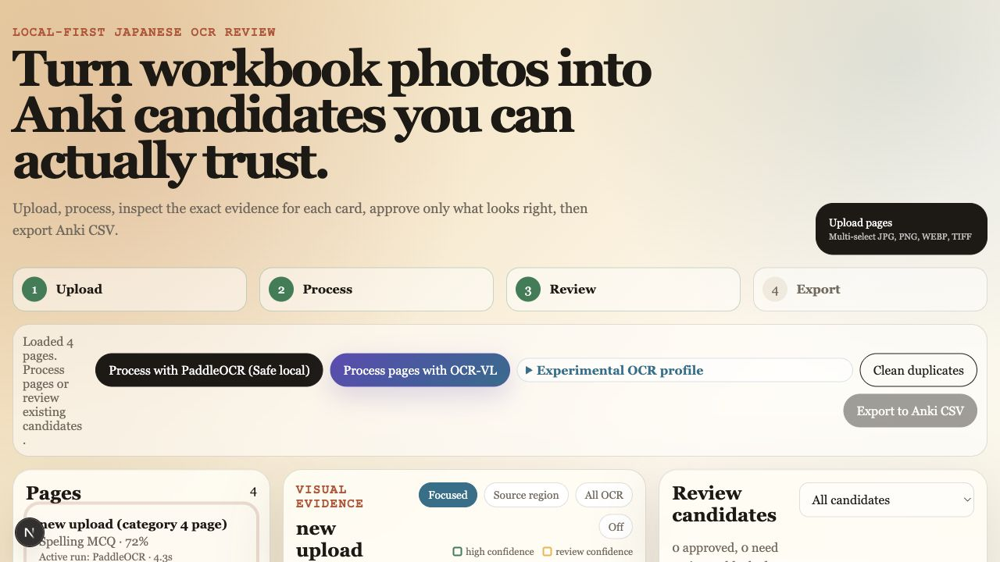
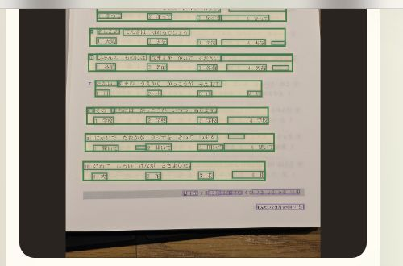
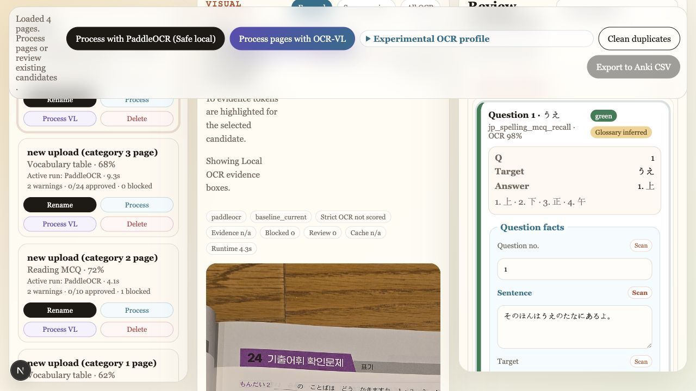

# Anki Maker Japanese

Local-first review workbench for turning Japanese workbook photos into Anki-ready CSV candidates.

This project is not trying to make a blind, fully trusted deck generator. It is built around a human-in-the-loop workflow: upload real study pages, run local OCR, inspect the exact visual evidence behind each candidate, fix anything suspicious, approve only the cards you trust, then export CSV files for Anki's text import.



## What It Does

- Uploads JPG, PNG, WEBP, and TIFF workbook pages from the browser.
- Runs local PaddleOCR by default, with Japanese OCR plus optional Korean OCR for glossary/meaning columns.
- Extracts review candidates from vocabulary tables and Japanese multiple-choice question pages.
- Shows the source page beside candidate cards, with OCR evidence boxes, confidence, warnings, and run metadata.
- Lets you edit fields, rescan a selected field region, mark green/yellow/red review state, and approve only exportable candidates.
- Keeps OCR run history per page so a better previous run can be reactivated after experiments.
- Exports approved candidates as UTF-8 CSV for Anki text import.
- Includes benchmark scripts for comparing OCR profiles, extraction variants, PaddleOCR-VL, and optional Google Vision diagnostics.

Current export scope is intentionally CSV-only. The app does not generate `.apkg` files, push through AnkiConnect, or claim that OCR output is correct without review.

## Workflow

1. Upload one or more workbook photos.
2. Process pages with the safe local PaddleOCR path, or opt into OCR-VL/experimental profiles for comparison.
3. Review each candidate against highlighted page evidence.
4. Edit card fields or rescan a field-level crop when needed.
5. Approve trusted candidates and leave red/blocked candidates excluded.
6. Export Anki CSV files.

The visual evidence panel is the main trust layer: OCR boxes can be shown directly on the uploaded page, either focused on the selected candidate or expanded to all detected OCR tokens.





Page names can be renamed in the UI without renaming files on disk. Re-uploading the same filename replaces the existing page record instead of piling up duplicates. Generated uploads, crops, processed images, exports, and SQLite databases are local runtime artifacts.

## App Shape

- `apps/web` - Next.js frontend, including the `StudyWorkbench` review interface and Playwright tests.
- `backend/app` - FastAPI app for uploads, page processing, OCR run state, candidate editing, and export.
- `backend/app/extraction` - OCR-backed vocabulary and MCQ extraction logic.
- `backend/app/ocr` - PaddleOCR, OCR-VL, crop OCR, comparison, runtime guards, and profile definitions.
- `backend/app/export` - Anki CSV serialization.
- `backend/scripts` - golden evaluation, OCR benchmark, and CSV import verification scripts.
- `data/evaluation` - canonical sample workbook images used by local benchmarks.
- `docs` - architecture and benchmark notes, plus README screenshots.

## Quick Start

One-command local dev:

```bash
cd apps/web
npm install
npm run dev
```

`npm run dev` starts the FastAPI backend on `127.0.0.1:8000` when it is not already running, waits for `/api/health`, then starts Next.js on `127.0.0.1:3000`.

Open <http://localhost:3000>.

The backend dev script uses `uv` with the repo-pinned Python from `backend/.python-version` (`3.12`). It first tries to install local OCR plus OCR-VL extras, then falls back to base PaddleOCR if only OCR-VL is unavailable. If PaddlePaddle does not publish a wheel for your Python/platform, the backend still starts without local OCR so the UI can run. Set `ANKI_MAKER_REQUIRE_LOCAL_OCR=1` if you want startup to fail instead.

Manual backend:

```bash
cd backend
uv sync --python 3.12 --group dev --extra ocr
uv run uvicorn app.main:app --reload --port 8000
```

Manual frontend:

```bash
cd apps/web
npm install
npm run dev
```

Docker fallback:

```bash
docker compose up
```

Docker is the recommended path for machines where local PaddlePaddle wheels are unavailable, especially macOS Intel laptops.

## OCR Modes

The default workflow is the lightweight PaddleOCR path. It uses Japanese OCR, optional Korean OCR for gloss columns, OCR-backed evidence fields, and review-state warnings so output remains editable and auditable. Vocab benchmark accuracy only counts rows where surface, reading, and Korean meaning are all supported by OCR evidence; local glossary data is not used to fill missing vocab rows.

Install default local OCR:

```bash
cd backend
uv sync --python 3.12 --group dev --extra ocr
```

PaddlePaddle wheel support is platform-specific. The current lockfile has wheels for common Linux x86_64, Windows x86_64, and macOS Apple Silicon Python versions, but not every Python/platform pair. If `uv sync` reports that `paddlepaddle` has no binary distribution, use the pinned Python 3.12 first, then Docker if the platform itself is unsupported.

PaddleOCR-VL is available as an optional document parser and candidate-generation path:

```bash
cd backend
uv sync --python 3.12 --group dev --extra ocr --extra ocr-vl
```

The backend exposes document parsing at `POST /api/pages/{page_id}/document/parse`. The UI exposes OCR-VL as a visibly separate, memory-guarded path for comparison. The default production workflow remains base PaddleOCR until OCR-VL performs better on the benchmark set.

Install Google Cloud Vision comparison support only if you want the optional comparator endpoint:

```bash
cd backend
uv sync --python 3.12 --group dev --extra ocr --extra cloud
```

Create a repo-level `.env` and place your Google service-account JSON at the path referenced by `GOOGLE_APPLICATION_CREDENTIALS`. This app uses the Google Cloud SDK credential-file flow rather than a raw `GOOGLE_API_KEY`.

Google Vision cloud calls are disabled by default even when credentials are installed. To use the no-cost free-tier comparison path intentionally, set:

```bash
export GOOGLE_VISION_ALLOW_CLOUD=true
export GOOGLE_VISION_CACHE_ENABLED=true
export GOOGLE_VISION_MONTHLY_CAP=1000
# Optional regional endpoint: us-vision.googleapis.com or eu-vision.googleapis.com
export GOOGLE_VISION_API_ENDPOINT=
```

Uncached successful Google Vision requests are tracked in `backend/usage/google_vision_usage.json`; cached image-hash results under `backend/ocr_cache/google_vision` do not increment the local ledger.

For local VLM cleanup, keep the default `VLM_CLEANUP_ENABLED=false` for the lowest-memory workflow. To experiment with Ollama:

```bash
ollama pull qwen3.5
export VLM_CLEANUP_ENABLED=true
export VLM_PROVIDER=ollama
```

Or run a multimodal `llama.cpp` server with OpenAI-compatible endpoints:

```bash
export VLM_CLEANUP_ENABLED=true
export VLM_PROVIDER=llama_cpp
export LLAMA_CPP_BASE_URL=http://localhost:8080
export LLAMA_CPP_MODEL=your-local-vision-model
```

Optional dictionary validation reads `DICTIONARY_PATH`, a JSON array shaped like:

```json
[{"surface": "学校", "reading": "がっこう"}]
```

## Sample Images And Local State

The four `data/evaluation/new upload (category N page).jpg` files are canonical benchmark fixtures. The screenshots above were captured from those local benchmark pages after processing.

Other uploaded images, processed images, crops, exports, and SQLite databases are disposable local runtime state. OCR run history is pruned automatically after terminal runs: by default the app keeps the active run, the latest two successful runs, and the latest failed/cancelled run per page. Tune that with `OCR_RUN_SUCCESS_RETENTION_PER_PAGE` and `OCR_RUN_FAILED_RETENTION_PER_PAGE` when a debugging session needs more history.

## Anki Export

Approved items export as UTF-8 CSV for Anki text import. Only approved candidates are exported by default, and red/blocked candidates stay excluded. When a selection contains both vocab and MCQ items, export returns separate CSV downloads by schema.

Vocabulary pages export one semantic `jp_vocab_entry` note row per `(Surface, Reading)` pair. Duplicate OCR candidates for the same pronunciation-to-kanji pair are collapsed during export, with the best Korean meaning retained as hidden context on the answer side. The vocab CSV uses:

```csv
VocabKey,Surface,Reading,MeaningKo,StudyWriting,StudyReading,StudyMeaning,StudyJapaneseToKorean,SourcePage,SourceBBox,Confidence,Warnings,tags
```

Create a `jp_vocab_entry` note type in Anki with fields matching those column names. `StudyWriting` is enabled by default, so the normal export is one pronunciation-to-kanji card per vocab note. `StudyReading`, `StudyMeaning`, and `StudyJapaneseToKorean` can be enabled per note when you intentionally want extra generated cards.

Recommended default card template:

```text
Kana to Kanji front: {{#StudyWriting}}{{Reading}}{{/StudyWriting}}
Kana to Kanji back:  {{FrontSide}}<hr id=answer>{{Surface}}<br><details><summary>Meaning</summary>{{MeaningKo}}</details>
```

Optional templates can use the same conditional-field pattern:

```text
Kanji to Kana front: {{#StudyReading}}{{Surface}}{{/StudyReading}}
Kanji to Kana back:  {{FrontSide}}<hr id=answer>{{Reading}}<br><details><summary>Meaning</summary>{{MeaningKo}}</details>

Meaning to Japanese front: {{#StudyMeaning}}{{MeaningKo}}{{/StudyMeaning}}
Meaning to Japanese back:  {{FrontSide}}<hr id=answer>{{Surface}}<br>{{Reading}}

Japanese to Korean front: {{#StudyJapaneseToKorean}}{{Surface}}{{/StudyJapaneseToKorean}}
Japanese to Korean back:  {{FrontSide}}<hr id=answer>{{MeaningKo}}
```

Multiple-choice pages keep the current front/back CSV schema:

```csv
notetype,front,back,source_page,source_bbox,confidence,tags
```

The target Anki collection must have matching note types such as `jp_vocab_entry` or `jp_spelling_mcq_recall` before import. Meaning-only Japanese-to-Korean vocab pages use the same `jp_vocab_entry` schema with a blank reading field and `study_japanese_to_korean` enabled.

Optional local verification against Anki's Python importer:

```bash
cd backend
uv sync --python 3.12 --group dev --extra anki-import
uv run python scripts/verify_anki_csv_import.py exports/example.csv
```

## Verification

Run the fast backend regression suite after code changes:

```bash
cd backend
uv run pytest -q
uv run python scripts/evaluate_golden.py
uv run python scripts/evaluate_golden.py --from-db --json
uv run python scripts/evaluate_golden.py --from-db --run-id run_... --json
uv run python -m compileall app scripts
```

Run the web checks:

```bash
cd apps/web
npx playwright install chromium
npm run test:coverage
npm run test:e2e
npm run lint
npm run build
```

The Playwright e2e smoke test fails on app-owned browser runtime errors, while ignoring external browser-extension noise such as `Extension context invalidated` from injected `content.js`.

## OCR Benchmarks

Run OCR mode benchmarks locally when comparing extraction quality or resource usage:

```bash
cd backend
uv run python scripts/benchmark_ocr_modes.py --json
uv run python scripts/benchmark_ocr_modes.py --engine all --vl-limit 1 --worker-max-rss-mb 14336 --json
uv run python scripts/benchmark_ocr_modes.py --profile-matrix --json
uv run python scripts/benchmark_ocr_modes.py --model-profile jp_v5_det_v5_rec --korean-profile ko_v5_current --extraction-variant v5_full_adapted_v1 --json
uv run python scripts/benchmark_ocr_modes.py --experiment-stage 0 --json
uv run python scripts/benchmark_ocr_modes.py --experiment-stage 1 --json
uv run python scripts/benchmark_ocr_modes.py --experiment-stage 2 --json
uv run python scripts/benchmark_ocr_modes.py --experiment-stage 3 --json
uv run python scripts/benchmark_ocr_modes.py --experiment-stage 4 --json
```

Experimental OCR profiles are intentionally separate from the default workflow. The UI exposes them under "Experimental OCR profile," and benchmark JSON records the exact profile, extraction variant, runtime/device info, preprocessing, cache status, document-graph metrics, and promotion gates. `--profile-matrix` and staged runs skip heavy server profiles unless `--include-heavy-profiles` is passed. Do not change the production default based only on the four canonical pages; use a holdout set before promoting a newer model.

Accuracy recovery v2 is available only as an experimental benchmark variant. It extends `accuracy_recovery_v1` with Japanese region recovery, Korean residual glyph recovery, MCQ prompt-line OCR, and MCQ choice-glyph source-field recovery while leaving the production default, CSV export semantics, and MCQ semantic scoring unchanged. Normal API/UI processing rejects benchmark-only variants unless the benchmark harness explicitly opts in. Strict benchmark fields must be backed by live OCR/image evidence; local glossary values and miss-inventory expected values are diagnostics only.

Benchmark runtime directories are scratch by default, even when `--work-dir` is supplied. The script preserves explicit JSON, Markdown, miss-inventory, and residual-diagnostics outputs, then removes per-page SQLite databases, processed images, and transient audit files. Use `--keep-work-dir` only when you need to inspect worker state.

Run the full v2 gate with diagnostics:

```bash
cd backend
uv run python scripts/benchmark_ocr_modes.py \
  --golden ../data/evaluation/golden_pages.example.json \
  --model-profile jp_v3_det_v3_rec \
  --korean-profile ko_v5_current \
  --extraction-variant accuracy_recovery_v2 \
  --work-dir ../.benchmark-runs/2026-05-08-accuracy-recovery-v2/final-work \
  --output-json ../.benchmark-runs/2026-05-08-accuracy-recovery-v2/accuracy-recovery-v2-final.json \
  --dashboard-markdown ../.benchmark-runs/2026-05-08-accuracy-recovery-v2/accuracy-recovery-v2-final-dashboard.md \
  --residual-diagnostics-dir ../.benchmark-runs/2026-05-08-accuracy-recovery-v2/residual-diagnostics
```

`--residual-diagnostics-dir` writes diagnostic-only JSON/contact-sheet artifacts after scoring. Extraction code never reads those artifacts, and focused miss inventories never reduce the full golden scoring set.

## Runtime Cleanup

Generated uploads, processed images, crops, exports, and SQLite databases are disposable local state:

```bash
find backend/uploads backend/processed backend/crops backend/exports -type f ! -name .gitkeep -delete
find backend -maxdepth 1 -type f -name "*.db" -delete
```
